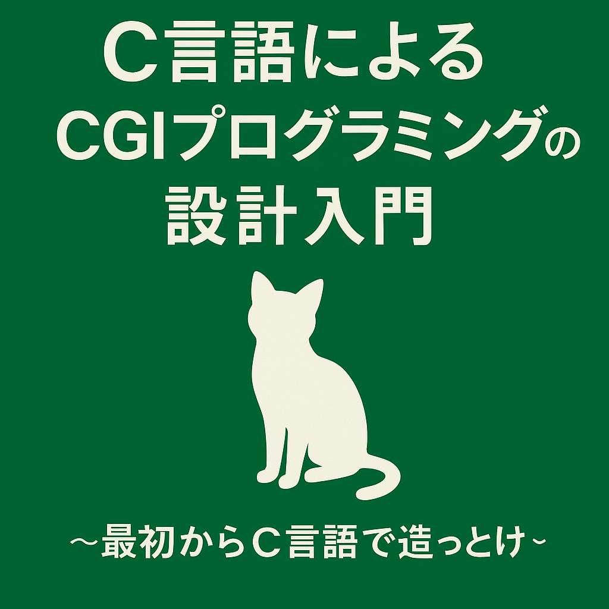

# C言語によるCGIプログラミングの設計入門  
〜最初からC言語で造っとけ〜

このリポジトリは、C言語でCGI（Common Gateway Interface）を使ってWebアプリケーションを構築するための教材です。  
Webの仕組みを理解したい人のために、フォーム入力、DB接続、HTML出力といった基本的な処理を  
**C言語で実装しながら学べる教材です。**

## 特徴
- C言語によるWebアプリ構築（CGI＋HTML＋ODBC）
- 標準入力や環境変数を使ったWebとの直接的なやり取りを理解できる
- MariaDBとの接続を含む実用的な構成
- ChatGPTとの対話を通じた設計・実装支援

## 想定読者
- C言語の基礎は学んだが、Webは未経験の方
- CUIまでしか触れてこなかったけど、GUIやWebに進みたい人
- フレームワークが担っている処理の仕組みをC言語で学びたい人

## 内容構成
1. [はじめに](./docs/01_はじめに.md)
2. [CGIとは何か？](./docs/02_CGIとは何か.md)
3. [最初のCGIプログラム](./docs/03_最初のCGIプログラム.md)
4. [フォームからのデータ受信（GET／POST）](./docs/04_フォームからのデータ受信.md)
5. [フォーム値の構造化とアクセス](./docs/05_フォーム値の構造化とアクセス.md)
6. [HTMLテンプレート生成とレスポンスヘッダ](./docs/06_HTMLテンプレート生成とレスポンスヘッダ.md)
7. [ODBCを使ったデータベース連携](./docs/07_ODBCを使ったデータベース連携.md)
8. [セッション管理と認証処理](./docs/08_セッション管理とユーザー認証.md)
9. [実践アプリ：簡易CMS（日記投稿アプリを作ってみよう）](./docs/09_実践アプリ：簡易CMS（日記投稿アプリ）を作ろう.md)
10. [API化：JSONレスポンスをつくってみよう](./docs/10_API化：JSONレスポンスをつくってみよう.md)
11. [Appendix：開発環境・デプロイTips集](./docs/11_Appendix：開発環境・デプロイTips集.md)
12. [おわりに](./docs/99_おわりに.md)

## ライセンス
本教材の著作権は Shintaro Suzuki に帰属します。  
詳細なライセンス内容については、[LICENSE](LICENSE) をご参照ください。