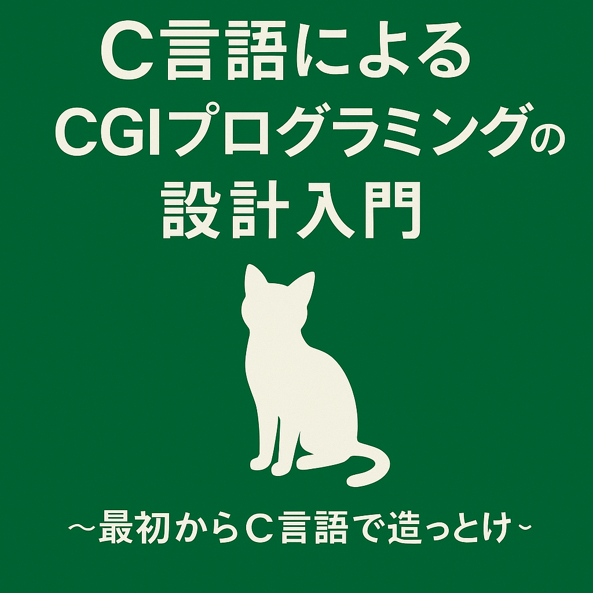

# C言語によるCGIプログラミングの設計入門  
〜最初からC言語で造っとけ〜

このリポジトリは、C言語でCGI（Common Gateway Interface）を使ってWebアプリケーションを構築するための教材です。  
Webの仕組みを理解したい人のために、フォーム入力、DB接続、HTML出力といった基本的な処理を  
**C言語で実装しながら学べる教材です。**

## 特徴
- C言語によるWebアプリ構築（CGI＋HTML＋ODBC）
- 標準入力や環境変数を使ったWebとの直接的なやり取りを理解できる
- MariaDBとの接続を含む実用的な構成
- ChatGPTとの対話を通じた設計・実装支援

## 想定読者
- C言語の基礎は学んだが、Webは未経験の方
- CUIまでしか触れてこなかったけど、GUIやWebに進みたい人
- フレームワークが担っている処理の仕組みをC言語で学びたい人

## 内容構成（予定）
1. [はじめに](./01_はじめに.md)
2. CGIとは何か？  
3. 最初のCGIプログラム  
4. フォームからのデータ受信（GET／POST）  
5. フォーム値の構造化とアクセス  
6. HTMLテンプレート生成とレスポンスヘッダ  
7. ODBCを使ったデータベース連携  
8. セッション管理と認証処理  
9. 実践アプリ：簡易CMS（日記投稿アプリを作ってみよう）  
10. API化：JSONレスポンスをつくってみよう  
11. Appendix：開発環境・デプロイTips集  
12. おわりに

## ライセンス
本教材の著作権は Shintaro Suzuki に帰属します。  
詳細なライセンス内容については、[LICENSE](./LICENSE) をご参照ください。

